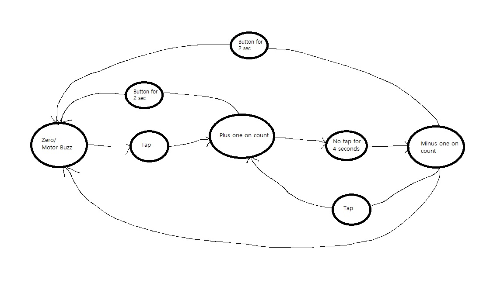

Ihyun Park
A16605545

Tutorial 1:

In tutorial 1, we learned how to display basic text onto the OLED in different rows, and to rather delete the rows or not.

Tutorial 2:

I found which axis was the x-axis by tilting the accelrometer and seeing which angle was increasing. There seems to always be acceleration in one direction due to the rotation of the Earth. Other than that, we learned how to use the accelerometer and use the values derived from it as integer values to print out onto a plot.

Tutorial 3:

In this tutorial, we learned about analog inputs and how to apply different duty cycles onto different modules. Two specific modules we learned to use were the led and the motor, which we activated at different duty cycles with one code.

Tutorial 4:

In this tutorial, we learned how to integrate sampling of the accelerometer in order to measure its values and implement it into our system. We sampled the values of the accelerometer in the three directions and plotted it into the serial and printed the sampling rate onto the OLED for display

Tutorial 5:

In this tutorial, we learned how to communicate data between the MCU and our computer, either via the serial port or the bluetooth by sending a text from our computer to our MCU and printing it on our MCU OLED. Then we sent that data back to our computer and printed in our terminal.

Challenge 1:

Challenge 2:

Challenge 3:

Video: https://www.youtube.com/shorts/4kGm-8mRJQE

For my solution, I simply found the date and time using the datetime module in python and saved them to a string. Then I noticed the OWM returns all of the weather info as a dictionary, so I query'd just the temperature and casted it as a string. Then I appended all of the strings with commas in between and sent it to the MCU and printed it onto the LED using the writeDisplayCSV, which writes the message onto the OLED with the commas being separated into newlines instead.