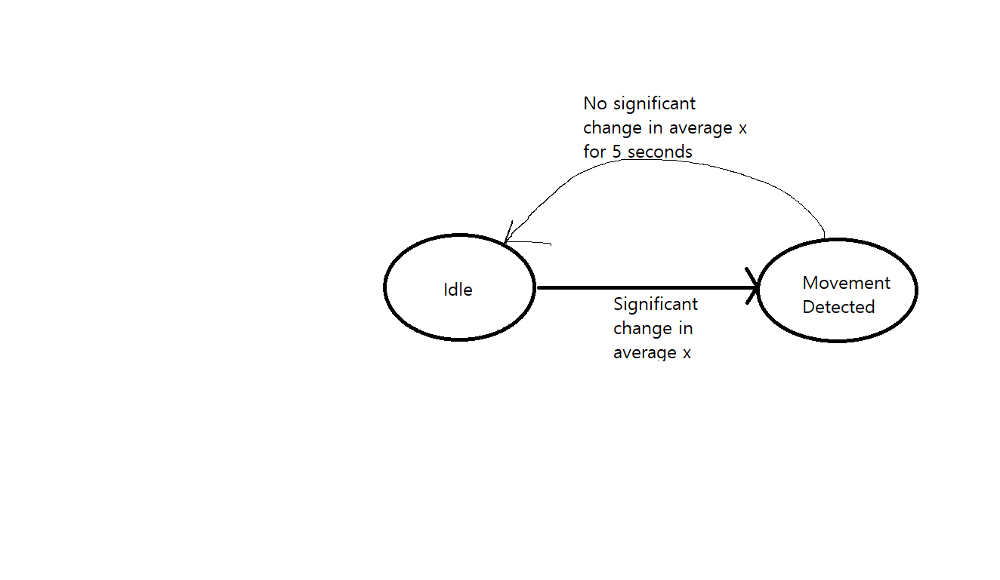

Ihyun Park
A16605545

Tutorial 1:

Q1: The output of the print(scout) statement is the instantiated value, where it represents the memory where the data is allocated at.

Q2: It prints out an error, as __breed is a private attribute and requires another function in order to be called outside of the class. Without it, it cannot be accessed out of the class' scope.

Q3: Shown in code

In this tutorial, we learned about object oriented programming within python, creating classes and the difference between public and private methods and attributes. We also learned how to create our own package, import it into another file and use methods within that program.

Tutorial 2:

In this tutorial, we learned how to plot in python, along with receiving data from our MCU and plotting that data in python using matplotlib and a communication package that we created using OOP.

Tutorial 3:

In t his tutorial, we learned how to plot in python while receivng data from the MCU and update the plot live. To do this, we also created a new package that updates our array of values that we receive from the MCU live.

Challenge 1:

https://www.youtube.com/watch?v=2QG_yLYZplU

Here we can see that the both L1 and L2 data are the same data although they are calculated using different methods. Delta x is relatively low when there is no movement, and average for the last 100 data is around 1800-1900. Data for the last 150 is pretty similar until there is a large movement and the two graphs differentiate a little bit. The last 100 plots, or 2 seconds gave a pretty smooth data although 3 seconds were also not too bad. The transformed graphs helped me understand the movement in graphs a little better as opposed to just seeing the raw data.

Challenge 2:

https://www.youtube.com/shorts/Suc57kVGXq4

I just made a very simple device where if a certain threshold has not been reached in the last 5 seconds, it goes to idle state, while if it detect any signficant change it goes to movement detected.

Challenge 3:

https://www.youtube.com/shorts/b3vNX0AO3-8

I simply moved the code from challenge 2 into a separate file and moved them to a class with a private initialization method and a public running method. I did not add any other changes, but with the same code you could change the messages by changing the arduino code which did not seem required. It plots with matplotlib decoupled from the data streaming, can detect active and inactive states and send messages accordingly, and is importable.