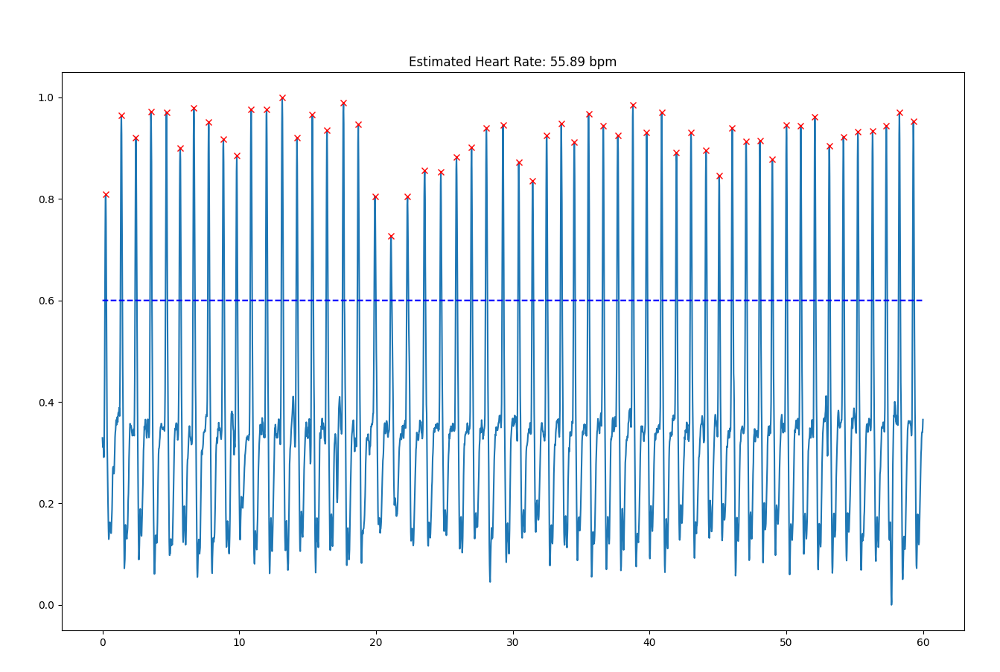
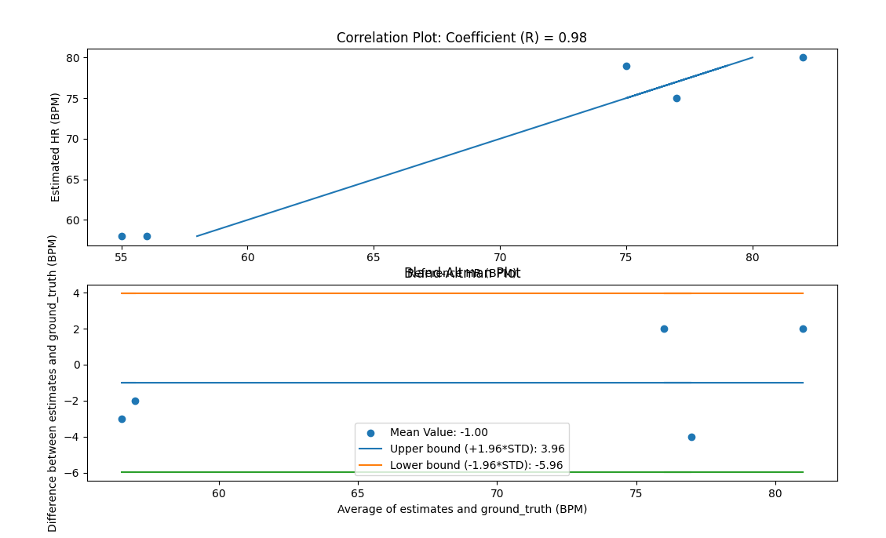
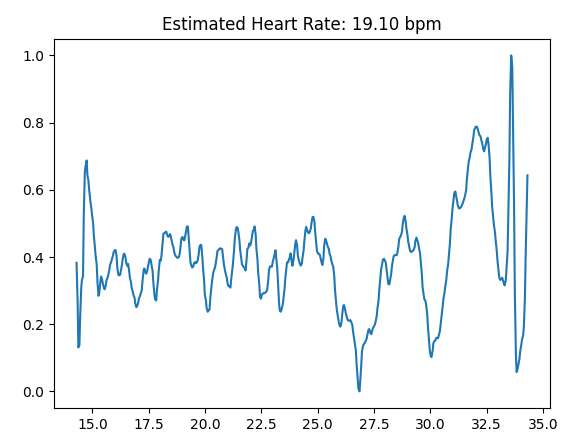

Ihyun Park A16605545
William Lynch A14588777

Tutorial 1:

1. The Arduino is capable of using both OLED and heartbeat sensor at the same time even when connected to the same input pin because the devices have different device addresses, so the MCU is capable of differentiating between them.

2. If the device is not connected, the serial will print the message and go into a permenant while loop. If we connect the device again the code will not proceed, and we will need to reupload the code as there is no break condition.

3. 
    ledBrightness = 128x1F;
    ledMode = 2;
    sample Rate = 200;
    adcRange = 8192;
4. The pulse width is in the unit of μs or micro seconds. A bigger pulse width would result in a higher light intensity, as increase in pulse width would increase voltage output.

5. For an ADC range of 16384, you would need 14 bits.

6. The peak wavelength for Red is, 670, IR is 900 and Green is 545 in nanometers.

7. ledMode will be need to set to 3 and use the getGreen() function.

In this tutorial, we learned how to use the MAX30101 Photodetector in order to detect the colors coming into the photodetector through our finger to detect our heartbeat. Additionally, we learned how to send data of our photodetector from our MCU to our python code and graph that incoming data using matplotlib.

Tutorial 2:

In this tutorial, we learned how to filter the data we receive from the photodetector in our python code so that we can count the peaks and compute heartrate in beats per minute, or BPM. First, after receiving data from the MCU, we detrended the drift, smoothed out the graph using moving average filtering, selected the peaks by finding the gradient, all from our previous DSP.py, and added a new function called normalize, so that we get a uniform data. Then, we thresholded the peaks to only count peaks above a certain threshold so we don't count any noise. Then we found the beats per minute by taking the average value of all of the time of all the peaks, or beats, and divding 60 by it. After trying this, we put all of this process into a class in our library, so that we can access it at ease. After installing the new library, we tested out with the provided data.

Tutorial 3:

In this tutorial, we just collected many data samples of our heartbeat for our next lab by saving the data we collect from our photodetector into a .csv file and saving it to our google drive. We simply just had to make sure our data wasn't terrible.

Challenge 1:

So in this challenge we were wanting to test our HRMonitor processing algorithm on our sampled data from earlier and try to find ways to improve the accuracy of the algorithm.
First, we used OS library to iterate through all of the csv files where our samples are.  And then filled an array with the determined BPM for each sampled data. We then
used a correlation plot and a B-A plot to determine the accuracy of our algorithm.
As far as the algorithm changes went, we disagree with the prompt when it says that there is much left to be desired by what was given.  In actuality this given algorithm
is very accurate.  It detected every peak in the samples, and when we moved on to challenge 2, it read out the same BPM as the apple watch would.  We do not believe
that we could create a more accurate heart rate reader than apple at this point in time.  However, in the spirit of the assignment we attempted an approach where
we would take intervals of the samples and take a local maximum and use that to determine the length to my next interval and counted up the loca l maximums, however
that approach does not work well when you get that interference as the signal raises in amplitude even if frequency is consistent.

https://youtu.be/-oVhJkKvMb8

|  |

|  |

Challenge 2:

For challenge 2 we were applying all that we have built so far and building a live heart rate reader.  We followed with how we implemented the live pedometer in the last
lab , but implemented using our HeartMonitor class instead.  We also included a case where if the heart rate grew to large or too low, we would output N/A as it means that
either the watch is not on or the person is dead.

https://youtu.be/-oVhJkKvMb8

Challenge 3:

In this challenge, instead of using a photodetector on the MCU, we used a normal webcam in order to measure heartbeat. By put our finger right up against the camera and shining a light on it, the camera sees the change in the amount of red, or blood, in our fingertips everytime our heart beats and we can take the average of that frame to put into our data to measure heartbeat. In my graph, we can see 22 beats in 16 seconds, which is about 1.4 beats per second or 84 beats per minutes. Sampling rate should be about 50 hz, or 50 samples every second and the sampling rate seems to be pretty consistent.

In this gif, I showed the basics of opencv:

|  |

Graph of my heartbeat using webcam:

|  |

Videos:
I've uploaded two videos of our heartbeat sensor working. The first video is with a little higher threshold for counting peaks and second is with a little lower threshold.

https://www.youtube.com/watch?v=nk_w7KmItK8

In this video we can see a little more consistent readings although there is a bit of error when I take the recording camera/flashlight off of my finger as the camera cannot read as well without the light.

https://www.youtube.com/watch?v=cTkaIriSYmE

In this video, we can see that the readings are a little all over the place and a lot more sensitive, but uploaded it to show that our camera was indeed working. You can see when the heart rate unprecedently drops to about 30, my heart immediately starts beating faster jumping to about 120, this is because I was scared I messed something up, I think. :)

|  |

This is the graph of my heartbeat when the I am not recording, and I have the webcam, finger and flashlight perfectly straight. The BPM it's showcasing is at 20 BPM because it shows the last BPM measured, and there was a big fluctuation in data when I moved my finger away from the camera to press escape.