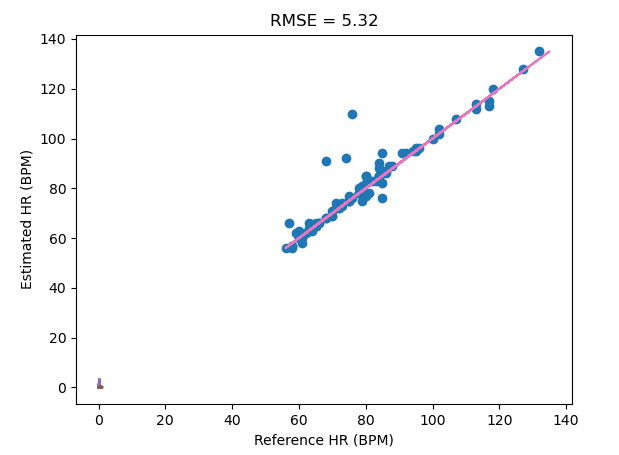

Ihyun Park A16605545
William Lynch A14588777

Tutorial 1:

In this tutorial, we learned how to prepare our dataset for training and testing. Initially, we learned how to import a large amount of data into our environment using glob and a specific naming convenion for files we want to read. Then after reading the data, we were able to extract the subjects from the title of the file. Using the information we extracted from the title, we calculated the time and estimated the FS and heart rate and filtered and plotted them like we did for our individual data in our last tutorial of lab 6.

Tutorial 2:

In this tutorial, we actually trained the data that we collected and validated it using Leave-One-Subject-Out-Validation or LOSOV for short. First, we loaded the data in as same as tutorial 1, then calculated the weight, mu and variance using the gmm function in sklearn. Then, we plotted the Gaussian probability density function using the norm function is scipy and compared it with the gmm to verify that the histogram looks correct. With the trained model, we look to estimate the heartrate using the model, by using np.diff in order to see where the data crosses from 0 to 1 or 1 to 0, since they represent the peaks. If we see where the output is equal to 1 after using np.diff, we can tell where the peaks are, and calculating over the time that we calculated in tutorial 1, we can estimate the bpm. We can plot the detected peaks over the filtered ppg data to see if our output is accurate. Now, we can validate our model using the LOSOV. Here we gathered all the data for all the subjects except for one subject in sequential order. Then we we process all of the data and appened it to the training vector, train it using the GMM method from earlier, then predict the labels for the excluded subject using the model and compute the esimated heart rate. If we do this excluding all of the subject once at a time, we would have estimated heart rate for all of the data.

Challenge 1:

|  |

RMSE:  5.106640556939345  Correlation:  0.9559554253211457  R2 Score:  0.9040537004938353  Explained Variance Score:  0.9083275192319572

We had an RMSE value of around 5.3, and this value is lower the better. We believe this value is like this due to some of the data that has severely outlying estimated data points that when subtracted from its ground truth value, causes a significant shift in the value of RMSE. With all of the data the RMSE value was as high as around 20, but deleting all of the data with severe noise, we were able to reduce this value down to 5.

The second metric we decided to use was the Correlation coefficient, since it tells us how closely related the estimated value is to the ground truth value. This value is higher the value, since estimation is better the more related it is to the reference values. For this we got a relatively high value of 0.95, which tells us that our model is pretty decent.

The third metric we decided to use was the R2 score, since it tells us how close the data is to the best fit line. The closer the value to 1.0, the better it is. Our best fit line would of course be a graph of our ground truth values vs ground truth values, which we graphed in the plot. Aside from a couple outliers, we can see that the best fit line goes through most of the data points, which supports our R2 score of around 0.9, a relatively high value, representing a pretty accurate estimation.

The final metric we decided to use was the Variance Score, which is basically the same as the r2 score, except it takes the mean error into the calculation. Simialrly, the closer the score is to 1.0, the better it is. To get the explained variance score, we subtract the mean error from the R2 score. If there is a significant or noticeable mean error value, meaning Explain variance score noticeably differs from the R2 value, it means we have bias in the error in our data, and we can see from the very similar value, that we have little bias in the error in our data.

Challenge 2:

